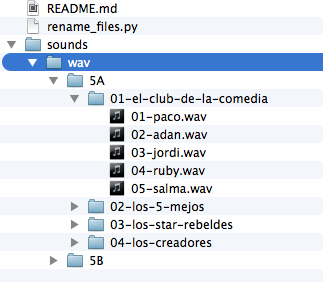

# pythonKeysToSound

Aplicación para ejecutar sonidos con teclas.
Dada una configuración csv y un directorio de sonidos, establece los sonidos asignados a cada tecla y canal.

En este caso el canal es el panel. Así que para un solo panel suena un sonido cada vez.

## Pasos a seguir

Si ya se ha configurado la aplicación, solo hace falta ejecutar:

`sudo python key_sounds.py`

Si falta configurar los sonidos/teclas:

* Copiar configuración de los alumnos de aqui: https://docs.google.com/spreadsheets/d/1AdaSmZuft90rgtyk7IMEA1gnvLNOWD1A-Dnyl0NklEU/edit#gid=43141471

Un extracto:

```
panel,grupo,alumno,color,numero,colortexto,tecla,uid
1,el-club-de-la-comedia,paco,,1,amarillo,a,0101
1,el-club-de-la-comedia,adan,,2,rojo,b,0102
1,el-club-de-la-comedia,jordi,,3,verde,c,0103

```

* Pasarlo a `csv` (`Download as csv...`). Renombrar a `alumnos.csv`.

* Pasar del csv al json:  `python csv2json.py`

* descargar los sonidos `.wav` y ponerlos en el directorio `sounds/wav`.

* Hacer la configuración json: `python get_files.py`

* Poner en marcha la applicación:

`sudo python key_sounds.py`

## Convenio de nombres de ficheros (importante)

El programa asigna sonidos mediante la búsqueda de un identificador "único" por cada elemento (alumno).
Ese `uid` se forma con el grupo (que es equivalente al panel), seguido de la numeración del alumno.
Por ejemplo

grupo 2, alumno 3 --> `uid = '0203'`

El directorio de sonidos tiene que ser de la siguente forma, para poder recuperar ese uid:




## Convertir de mp3 a wav

* instalar `pydub`: `pip install pydub`

* ejecutar:  `python convert_mp3_to_wav.py` (cambiar en el archivo el directorio a convertir y la opción de eliminar o no los mp3).

## instalar pygame (osx, windows, linux)

* puede que se necesite instalar `pygame`: `pip install pygame`


